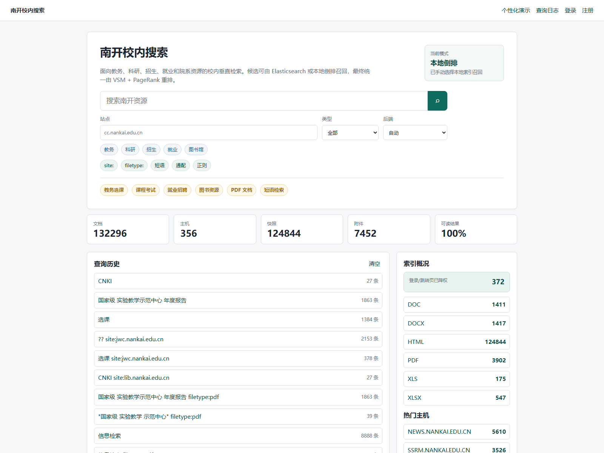
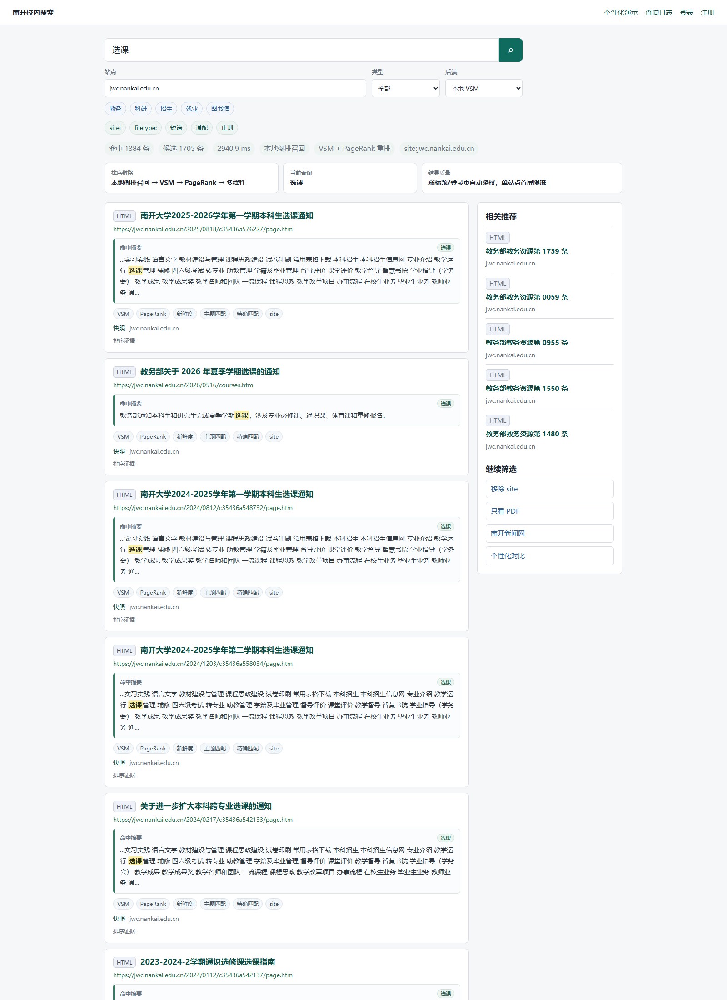
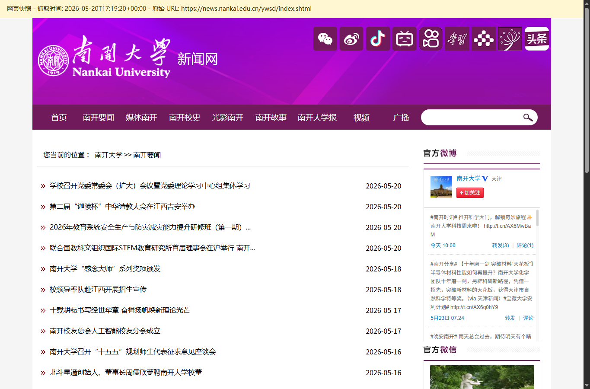
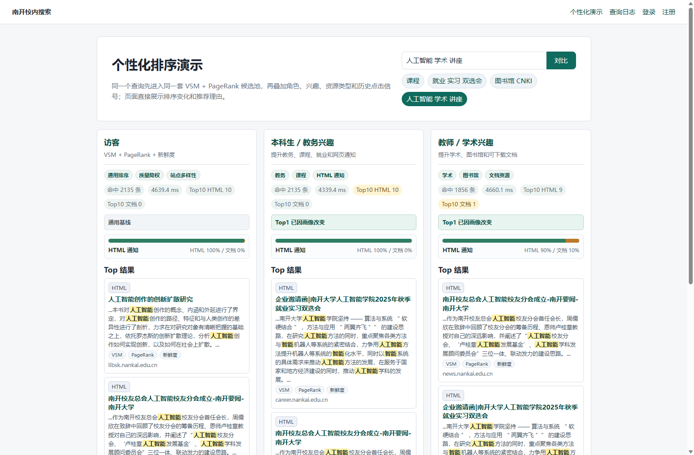
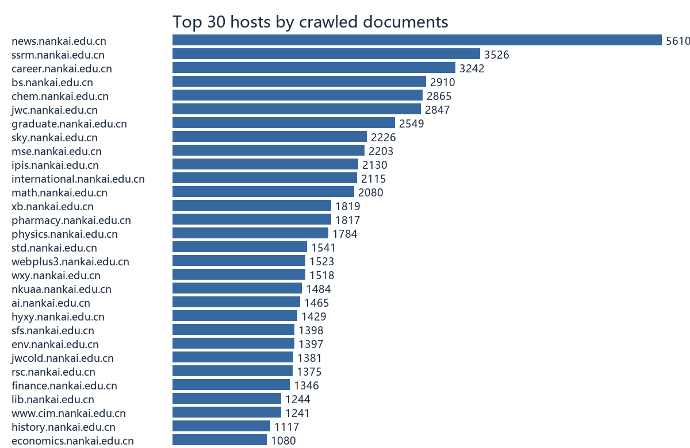
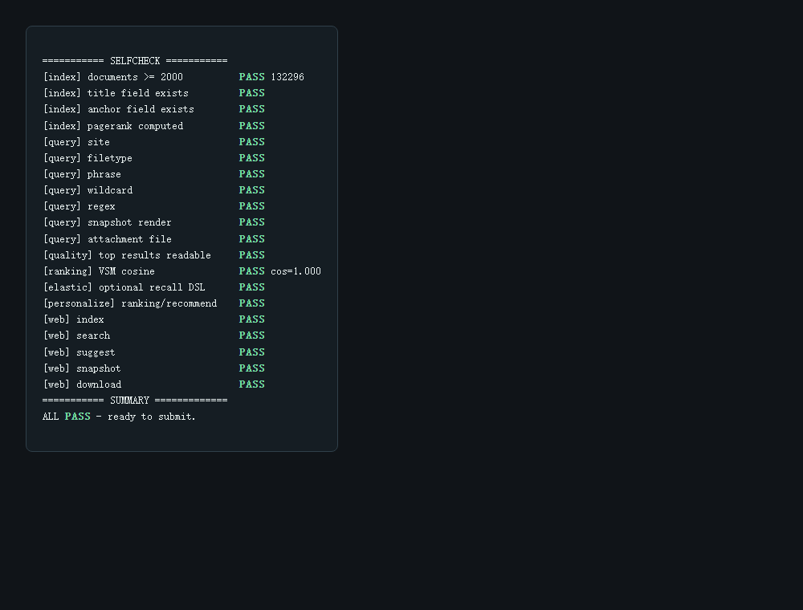

# NKU Campus Search

南开校内搜索引擎，信息检索 HW4 课程项目。项目面向 `*.nankai.edu.cn` 校内资源，实现从礼貌抓取、文档解析、索引构建、查询解析、排序重排到 Web 展示、查询日志、网页快照、个性化排序和推荐的一整套搜索流程。

推荐 GitHub 仓库名：`nku-campus-search`

GitHub description：

```text
A Nankai University campus vertical search engine with polite crawling, TF-IDF/VSM + PageRank ranking, Elasticsearch/local recall, Flask UI, snapshots, query logs, personalization, and recommendations.
```

中文简介：

```text
面向南开大学校内资源的垂直搜索引擎，支持礼貌爬取、文档解析、TF-IDF/VSM + PageRank 排序、Elasticsearch/本地索引召回、Flask Web 界面、网页快照、查询日志、个性化排序和推荐。
```



## 项目特点

- 校内垂直抓取：限定 `*.nankai.edu.cn`，遵守 `robots.txt`，默认礼貌延迟。
- 多类型文档解析：支持 HTML、PDF、DOC、DOCX、XLS、XLSX。
- 双召回后端：可选 Elasticsearch 召回，也保留本地倒排索引兜底。
- 排序模型清晰：最终排序由应用层完成，核心为 TF-IDF 向量空间模型，结合 PageRank、新鲜度和个性化信号重排。
- 六类查询能力：站内查询、文档查询、短语查询、通配查询、查询日志、网页快照。
- Web 交互完整：Flask 页面支持搜索、筛选、快照、附件下载、登录注册、历史记录和个性化演示。
- 个性化推荐：根据用户角色、兴趣标签和历史行为调整排序，并提供相关推荐。
- 课程交付友好：包含报告、PPT、讲解稿、抓取证据和自动打包命令。

## 项目截图

| 首页和数据概览 | 查询结果与排序链路 |
| --- | --- |
|  |  |

| 网页快照 | 个性化排序演示 |
| --- | --- |
|  |  |

| 抓取主机分布 | 端到端自检 |
| --- | --- |
|  |  |

## 当前数据规模

本地实验语料已抓取并索引南开域名文档，报告和截图中记录的规模为：

- 文档：132296 条
- 主机：356 个
- HTML 快照：124844 份
- 附件：7452 个
- 可读结果：100%

完整语料、索引、快照和附件体积较大，默认不进入 Git 仓库。克隆仓库后可以使用 demo 数据快速运行，也可以重新抓取并构建本地索引。

## 目录结构

```text
.
├── 代码/                  # Python 工程，使用 pixi 管理环境
│   ├── nku_search/        # crawler / parser / indexer / search / web / cli
│   ├── templates/         # Flask 模板
│   ├── static/            # Web 样式与脚本
│   ├── tests/             # pytest 测试
│   ├── scripts/           # ES 启动、抓取辅助脚本
│   ├── data/              # 本地语料和索引，默认被 Git 忽略
│   ├── pixi.toml
│   └── README.md          # 代码目录内的详细运行说明
├── report/                # Typst 报告、PPT、讲解稿和图片
├── 说明文档/               # 课程提交说明材料、截图、抓取证据
├── 要求.md                 # 作业要求摘录
└── README.md              # GitHub 项目首页
```

## 快速运行

项目使用 [pixi](https://pixi.sh/) 管理 Python 环境。

```powershell
cd 代码
$env:PYTHONIOENCODING="utf-8"
pixi install
pixi run init-demo
pixi run selfcheck
pixi run serve
```

浏览器打开：

```text
http://127.0.0.1:5000
```

个性化排序演示页面：

```text
http://127.0.0.1:5000/personalization-demo
```

## Elasticsearch 召回后端

Elasticsearch 是可选召回后端，不是必需依赖。未启动 ES 时，系统会自动回退到本地索引；启动 ES 后，可以查看 Elasticsearch 召回 + 应用层 VSM 重排链路。

```powershell
cd 代码
.\scripts\start_es.ps1
pixi run build-es-index
$env:NKU_SEARCH_BACKEND="auto"
pixi run serve
```

如果本机没有 Elasticsearch，可以让脚本下载并安装到本地工具目录：

```powershell
.\scripts\start_es.ps1 -InstallIfMissing
```

默认 ES 地址为 `http://127.0.0.1:9200`，默认索引名为 `nku_search_pages`。可以通过 `NKU_SEARCH_ES_URL` 和 `NKU_SEARCH_ES_INDEX` 修改。

## 命令行检索

```powershell
cd 代码
pixi run search -- "操作系统 site:cc.nankai.edu.cn"
pixi run search -- "信息检索 filetype:pdf"
pixi run search -- "\"南开 大学\""
pixi run search -- "温*"
pixi run search -- "计?"
pixi run search -- --backend es "信息检索 filetype:pdf"
pixi run search -- --backend local "操作系统 site:cc.nankai.edu.cn"
```

## 抓取和索引

先预检定向 frontier：

```powershell
cd 代码
pixi run targeted-crawl -- --dry-run
```

确认网络环境后继续增量抓取并重建索引：

```powershell
pixi run targeted-crawl -- --target-new 30000
pixi run build-index
pixi run build-es-index
```

抓取运行数据位于 `代码/data/`，主要包括：

- `documents.jsonl`
- `search_index.json`
- `links.tsv`
- `frontier.txt`
- `snapshots/`
- `attachments/`
- `nku_search.sqlite3`

这些文件通常很大或依赖本机路径，因此由 `.gitignore` 排除。

## 测试和自检

```powershell
cd 代码
pixi run test
pixi run selfcheck
```

`selfcheck` 会覆盖索引、查询解析、VSM 排序、PageRank、快照渲染、附件下载、Web 路由、推荐和可选 ES DSL 等端到端能力。

## 报告和打包

报告和 PPT 源码在 `report/`。生成课程提交材料：

```powershell
cd 代码
pixi run report -- --student-id 学号 --name 姓名
pixi run package -- --student-id 学号 --name 姓名
```

生成的压缩包遵循 HW4 要求：

```text
学号_姓名_hw4.zip
├── 代码/
├── 说明文档/
└── 演示视频/
```

## Git 提交说明

`.gitignore` 已排除以下本地产物：

- 本地 agent / Trellis 工作目录：`.agents/`、`.claude/`、`.codex/`、`.trellis/`
- 10 万级抓取语料、索引、快照和附件
- 本地 Elasticsearch 解压包和下载工具
- pixi 本地环境、pytest 缓存、临时渲染图和运行日志
- 课程打包生成的 `*_hw4.zip` / `*_hw4/`

公开发布前，建议再检查报告、截图和说明材料中是否包含真实学号、姓名或本机路径。
